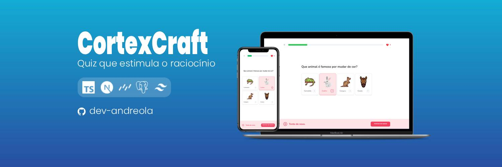

# Córtex



## Overview

The Córtex craft is a quiz platform to stimulates the thinking of people who have suffered from aphasia.

[View Project](https://ecommerce-cara-clothing.vercel.app/)

## :man_mechanic: Languages and Tools

- TypeScript
- Next.js
- TailwindCSS
- Drizzle ORM
- PostgreSQL

## :computer: Dependencies

```shell
# 1. Clone the project

git clone https://github.com/dev-andreola/cortex-craft

# 2. Install dependencies

yarn

# 3. Run the project

yarn dev
```

## :triangular_flag_on_post: Contribute to the project

Any contributions you make are **greatly appreciated**.

If you have any corrections or improvements that would make this better, please fork the repo and create a pull request.

1. Fork the Project
2. Create your Feature Branch (`git checkout -b feature/Feature`)
3. Commit your Changes (`git commit -m 'Add some Feature'`)
4. Push to the Branch (`git push origin feature/Feature`)
5. Open a Pull Request
